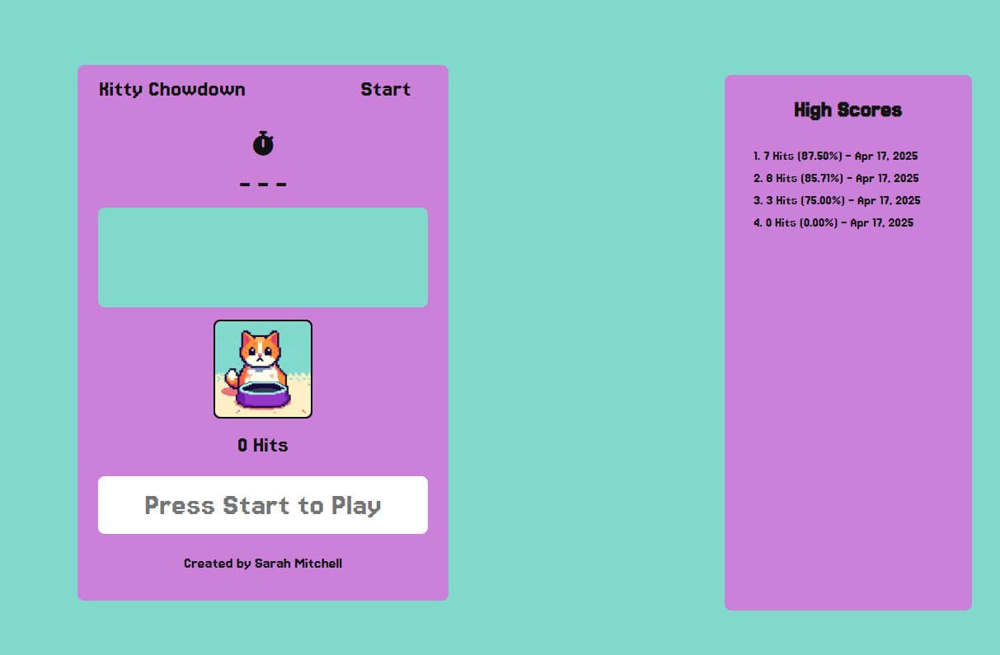

# Kitty Chowdown 🐱

This is the final project for Object Oriented Javascript, a typing speed game
where users type words that appear on the screen before the time runs out.

## Project Features

-   **Interactive Gameplay:** Users type displayed words against a countdown timer.
-   **Dynamic Cat Illustration:** Features six different states of a kitty cat illustration, reflecting the user's typing accuracy and speed.
-   **Responsive Design:** Ensures the game is playable on various screen sizes.

### Use Cases
- Typing enthusiasts can practice daily to improve speed and accuracy, using the timer and scores to track progress over time.
- Educators might incorporate it into classrooms for engaging typing lessons, with the cat feedback providing immediate visual motivation for students.
- Casual gamers on mobile devices can play quick sessions to unwind, benefiting from the responsive design and local storage for persistent high scores.

## Technologies Used

-   HTML5
-   CSS3
-   JavaScript
-   Font Awesome (for icons)
-   Google Fonts
-   Music from #Uppbeat

## New to Update 2.0

-   **High Scores with Local Storage:** A scoreboard has been implemented to track and display high scores. Scores are now saved locally using your browser's local storage, allowing you to see your best performances even after closing the game.

## Future Developments

-   **Background Design:** Add visual design elements to the background to enhance the game's aesthetic.
-   **Animated Cat Illustrations:** Replace static cat images with animated GIFs to add more dynamic feedback.
-   **Sound Effects:** Incorporate crunching noises when the user types words correctly to enhance the auditory experience.

## Check it out

[Kitty Chowdown](https://sarsbars.github.io/typing-game-2.0/)
